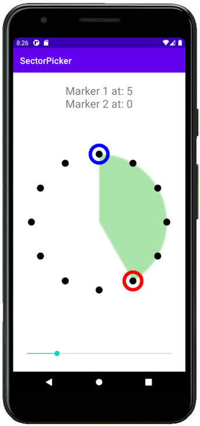

SectorPicker
===============
Simple Android widget to allow the user to position markers on a circle of points, and set to a sector size or angle of their choosing.



Usage
-----
Include 'SectorPicker' in your layout XML:

```xml
<com.github.androidtempley.sectorpicker.SectorPicker
        android:layout_width="match_parent"
        android:layout_height="match_parent"
        android:id="@+id/sectorPicker"
        android:paddingHorizontal="32dp"
        app:numPoints="12"
        app:pointRadius="8dp"
        app:markerRadius="20dp"
        app:markerLineWidth="8dp"
        app:fillColor="#5500AA00" />
```

Add as a dependency into your application build.gradle file:
```groovy
dependencies {
    implementation 'com.github.androidtempley:SectorPicker:v1.0.2'
}
```

You will also need to add the JitPack repository to your root build.gradle:
```groovy
allprojects {
    repositories {
        ...
        maven { url 'https://jitpack.io' }
    }
}
```

License
-------

    Copyright 2012 Square, Inc.

    Licensed under the Apache License, Version 2.0 (the "License");
    you may not use this file except in compliance with the License.
    You may obtain a copy of the License at

       http://www.apache.org/licenses/LICENSE-2.0

    Unless required by applicable law or agreed to in writing, software
    distributed under the License is distributed on an "AS IS" BASIS,
    WITHOUT WARRANTIES OR CONDITIONS OF ANY KIND, either express or implied.
    See the License for the specific language governing permissions and
    limitations under the License.

